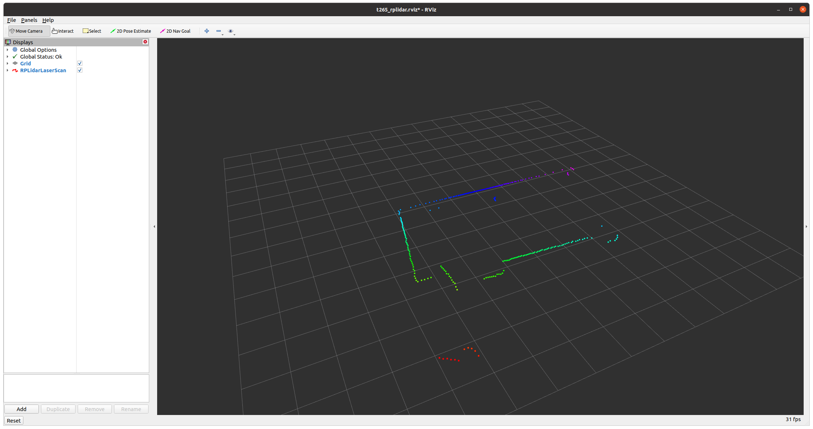

Ubuntu 20.04 ROS Noetic Example how to setup Intel RealSense T265 with RPLIDAR. T265 will be used for odometrydata 

# Hardware
This package provide a [STL file](stl/t265_rpilidar_bracket.stl) for a bracket which you can print with a 3D printer. This bracket connects the T265 with the RPILIDAR.

# Setup
* Setup ROS Noetic
* Create a catkin workspace
* Install [Intel RealSense SDK](https://github.com/IntelRealSense/librealsense)
* Clone [realsense-ros](https://github.com/IntelRealSense/realsense-ros) into your catkin workspace src folder
* Clone [rplidar_ros](https://github.com/robopeak/rplidar_ros) into your catkin workspace src folder
* Clone [ros_t265_rplidar](https://github.com/mirkix/ros_t265_rplidar) into your catkin workspace src folder
* Run `catkin_make` in your workspace folder

# Run
* Run `source devel/setup.bash` in your workspace folder
* Run `roslaunch ros_t265_rplidar t265_rplidar.launch` in your workspace folder
* You should now see the Laserdata in a rviz windows and be able to move your T265 and RPILIDAR

 
